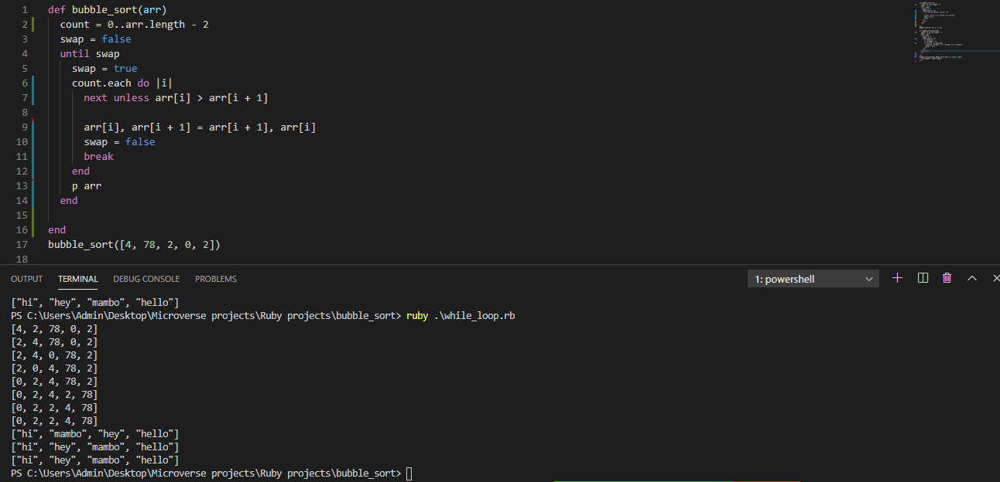

# Bubble_sort Algorithm

This project was completed under Microverse remote software development curriculum. The requirement was to implement a bubble sort algorithm without using the sort inbuilt method in ruby programming language. The algorithm should sort array elements in ascending order by comparing two adjucent array elements at a time. If the array element on the left is greater than the array element on the right, their positions should be swapped. Another requirement was to develop a bubble sort by algorithm with a method that uses the ###yield keyword. The bubble sort and bubble sort by algorithms developed in this project run and output in the terminal.

Here is an illustration of the bubble sort algorithm.

Here is a screenshot to demostrate the bubble sort developed.

## Built With

- Ruby

## Live Demo
Remember to click the run tab in middle top to run the algorithm for output.

[Live Demo Link](https://repl.it/@vanheavenui/bubblesort)

### Prerequisites

- Text editor (Preferrably Vscode)
- Ruby runtime
- Terminal

### Setup

- Clone or download the repository to a folder on your local machine.

## Authors

👤 **Dickens Juma**

- Github: [@githubhandle](https://github.com/DickensJuma)
- Twitter: [@twitterhandle]()
- Linkedin: [linkedin]()
- Email: [Email](dickensjuma13@gmail.com) 

👤 **Mworekwa Ezekiel**

- Github: [@githubhandle](https://github.com/vanheaven-ui)
- Twitter: [@twitterhandle](https://twitter.com/MworekwaE)
- Linkedin: [linkedin](https://linkedin.com/in/vanheaven/)
- Email: [Email](vanheaven6@gmail.com)  

🤝 Contributing
Contributions, issues and feature requests are welcome!

Feel free to check the issues page on [issues](https://github.com/vanheaven-ui/bubble_sort/issues).

Show your support
Give a ⭐️ if you like this project!
